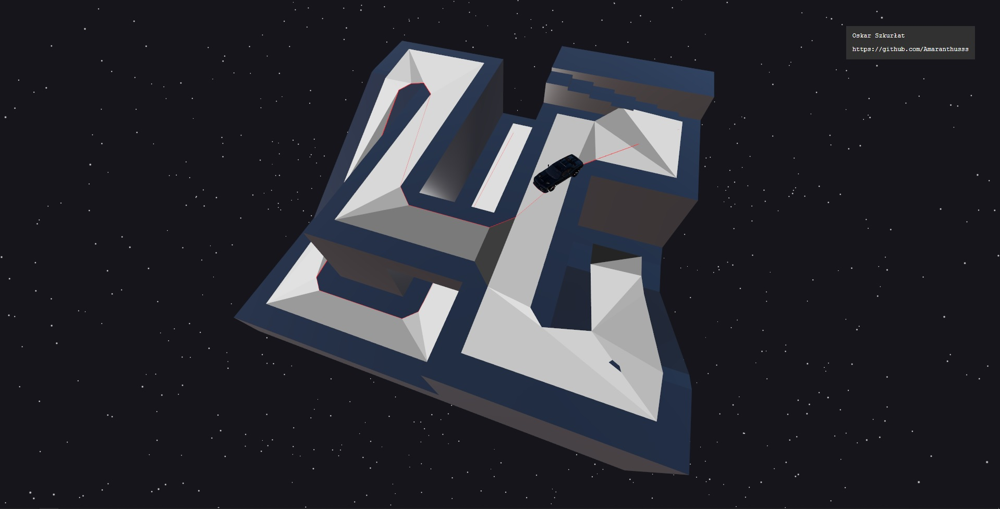

# [Front-End Web Application]

## ReactJS / NextJS / ThreeJS / YukaJS Game Engine Prototype [2023]

This repository contains prototype of the simple 3D game engine. Includes movement system with a path finding - library Yuka calculates the shortest paths with nav mesh usage.

## Main technologies:

**ReactJS** - A JavaScript library for building user interfaces.

**NextJS** - Next.js is a React framework that gives you building blocks to create web applications. By framework, we mean Next.js handles the tooling and configuration needed for React, and provides additional structure, features, and optimizations for your application.

**ThreeJS** - Cross-browser JavaScript library and application programming interface (API) used to create and display animated 3D computer graphics in a web browser using WebGL.

**Yuka** - A JavaScript library for developing Game AI.

**Lodash** - A modern JavaScript utility library delivering modularity, performance & extras.

**@react-three/fiber** - React renderer for three.js.

**@react-three/drei** - A growing collection of useful helpers and fully functional, ready-made abstractions for @react-three/fiber.

**@react-three/postprocessing** - Postprocessing wrapper for @react-three/fiber.

**TypeScript** - A strongly typed programming language that builds on JavaScript for a better tooling at any scale.

## Scripts / Commands:

Read more at the [NextJS documentation](https://nextjs.org/docs/getting-started).

## Models sources:

2018 Dodge Challenger SRT Hellcat [[Emmanual Robinson, Jr.](https://sketchfab.com/3d-models/2018-dodge-challenger-srt-hellcat-e31b4430d9934f61b212f55f194c9ef7)]

NavMesh / Platform [[tamani-coding](https://github.com/tamani-coding/threejs-navmesh-example)]

## Useful tools:

### [UPBGE](https://upbge.org/#/)

UPBGE is an open-source, 3D game engine forked from the old Blender Game Engine and deployed with Blender itself. This unified workflow is its main strength, as you can make your game from start to finish without leaving Blender.

### [GLTF/GLB to JSX](https://github.com/pmndrs/gltfjsx)

`npx gltfjsx model.glb --transform`
